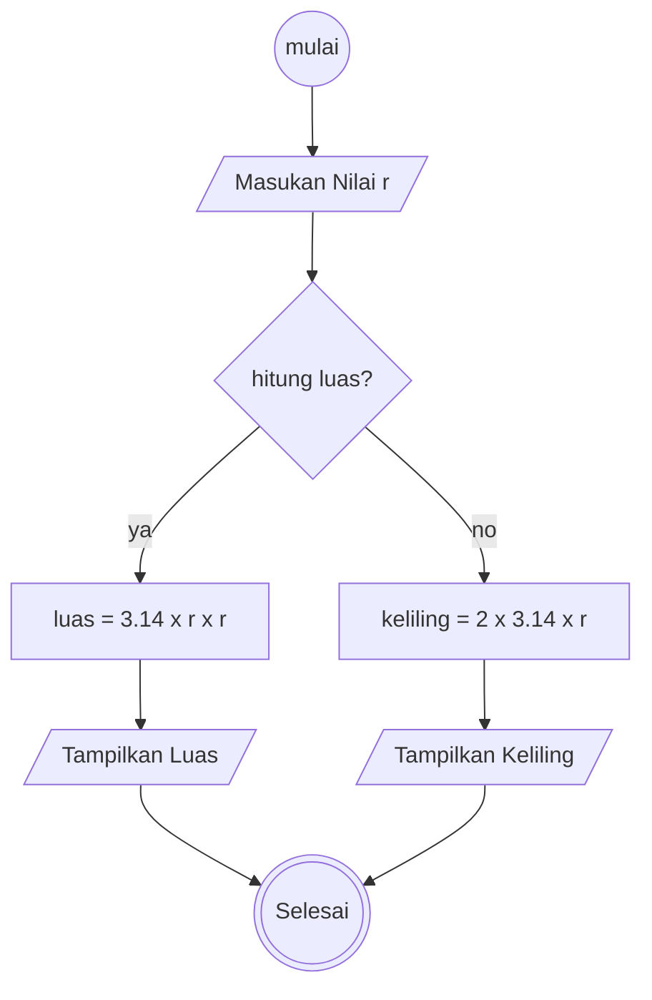

```mermaid
flowchart TD
    start((mulai)) --> input[/Masukan Nilai r/]
    input --> pilih{hitung luas?}
    pilih -- ya --> luas[luas = 3.14 x r x r]
    pilih -- no --> keliling[keliling = 2 x 3.14 x r]

    luas --> luasT[/Tampilkan Luas/]
    keliling --> kelilingT[/Tampilkan Keliling/]

    luasT --> selesai(((Selesai)))
    kelilingT --> selesai
```
