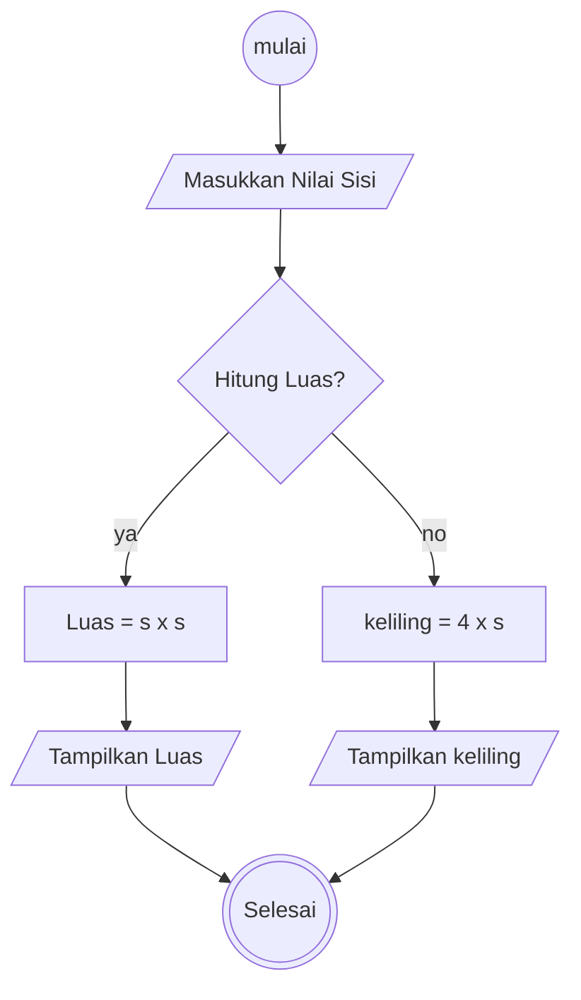

# Flowchart Luas dan keliling Persegi

```mermaid
flowchart TD
    start((mulai))--> input[/Masukkan Nilai Sisi/]
    input --> cek{Hitung Luas?}
    cek -- ya --> luas[Luas = s x s]
    cek -- no --> keliling[keliling = 4 x s]
    luas --> tL[/Tampilkan Luas/]
    keliling --> tk[/Tampilkan keliling/]

    tL --> selesai(((Selesai)))
    tk --> selesai
```
